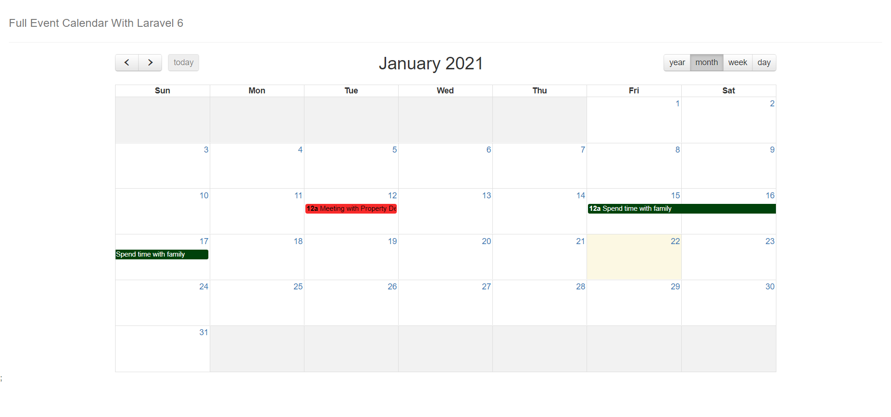
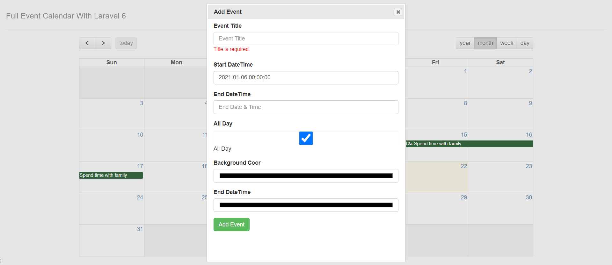
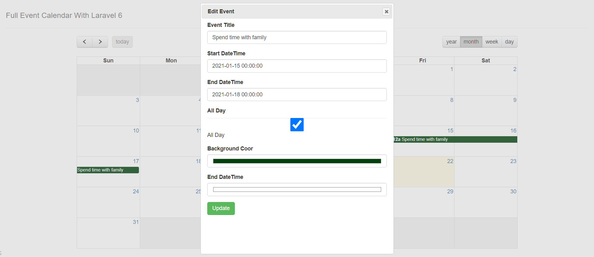

## About Event Calendar

I have integrated FullCalendar with laravel 6. Now you can create/update event.  
I have used API to fetch data from database according to Year, month, week and day wise. 
You don't access directly through URL without having token. Token is automatically generated when calendar event render. 

## Important Note

Default URL to access calendar : http://localhost/calendar  
If you want to change according to you. Then you have to change in the function.js file which are located in asset/js/function.js.  
Default code : events:"http://localhost/calendar/eventController",  
You want change : events:"http://website.com/directory_name/eventController",  

## Demo URL
<a href="http://getdebest.com/calendar/" >Demo URL</a> 

## Screenshot

## Contributing

Thank you for considering contributing to the Event Calendar!.

## Security Vulnerabilities

If you discover a security vulnerability within Laravel, please send an e-mail to Pavan Sengar via [pavan9212@gmail.com](mailto:pavan9212@gmail.com). All security vulnerabilities will be promptly addressed.

## License

The Laravel framework is open-sourced software licensed under the [MIT license](https://opensource.org/licenses/MIT).
